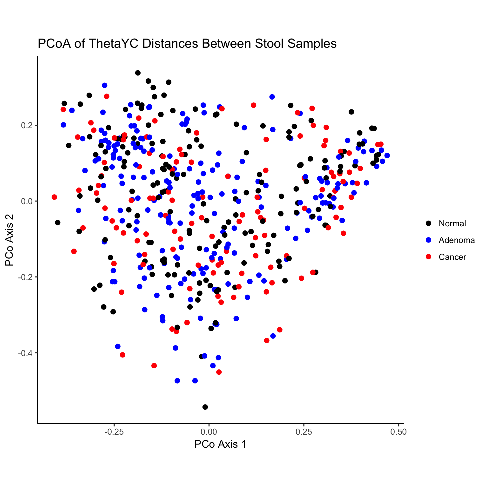
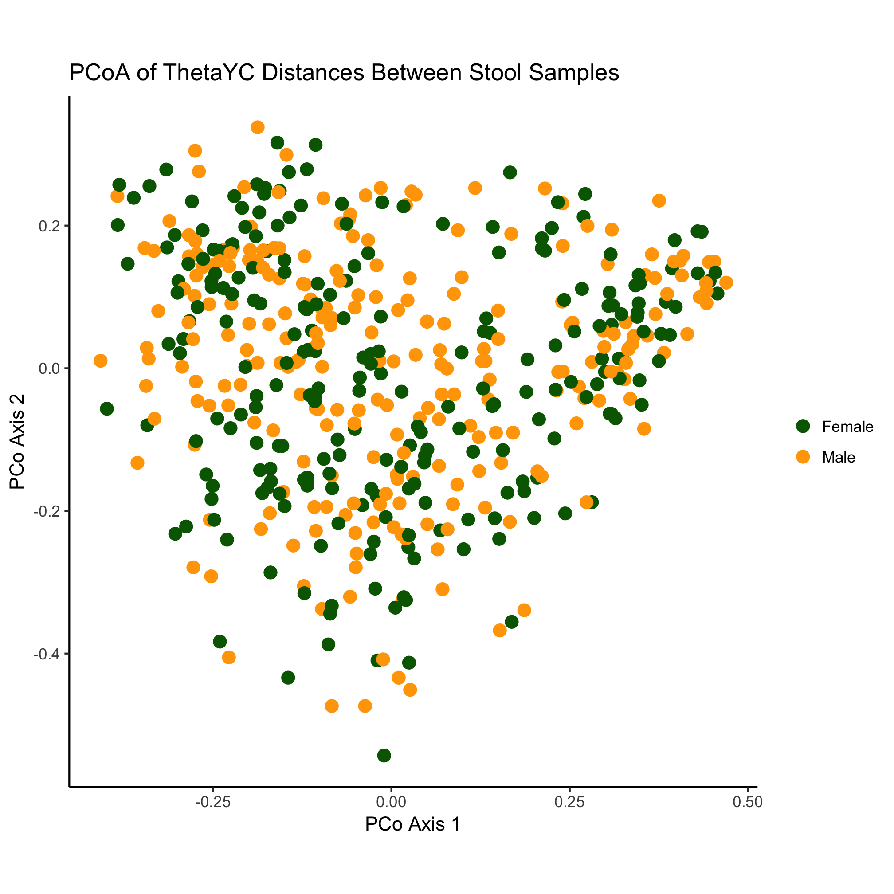
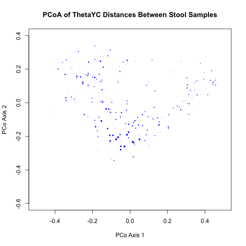
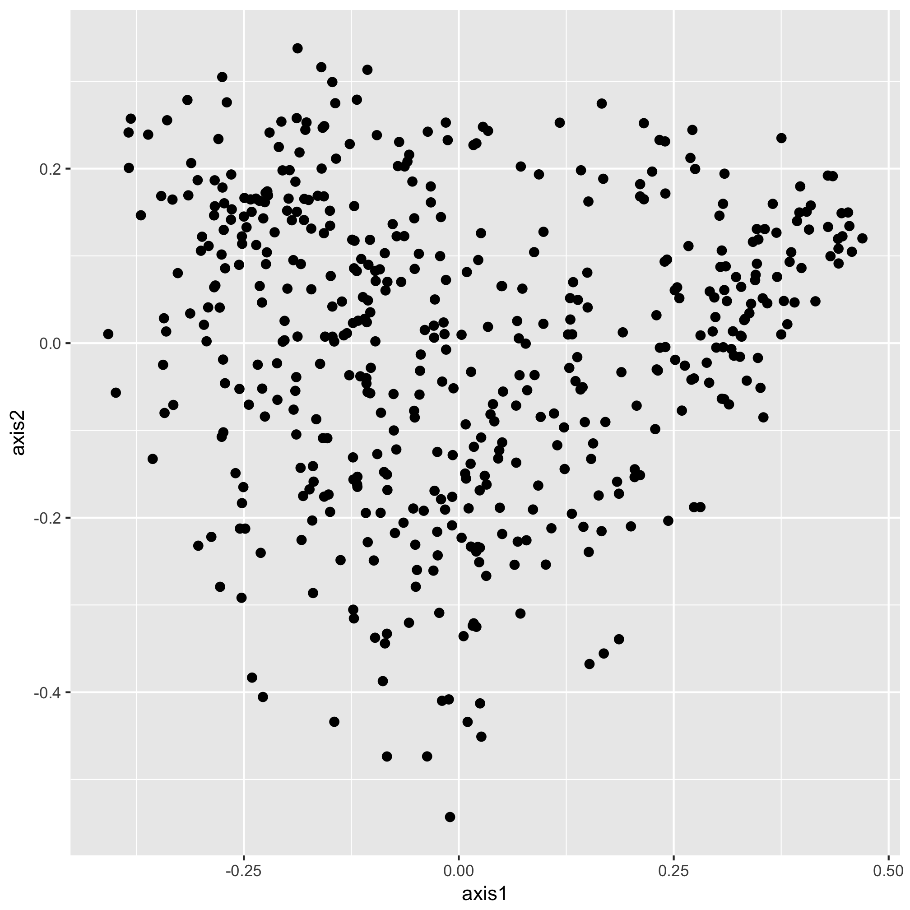
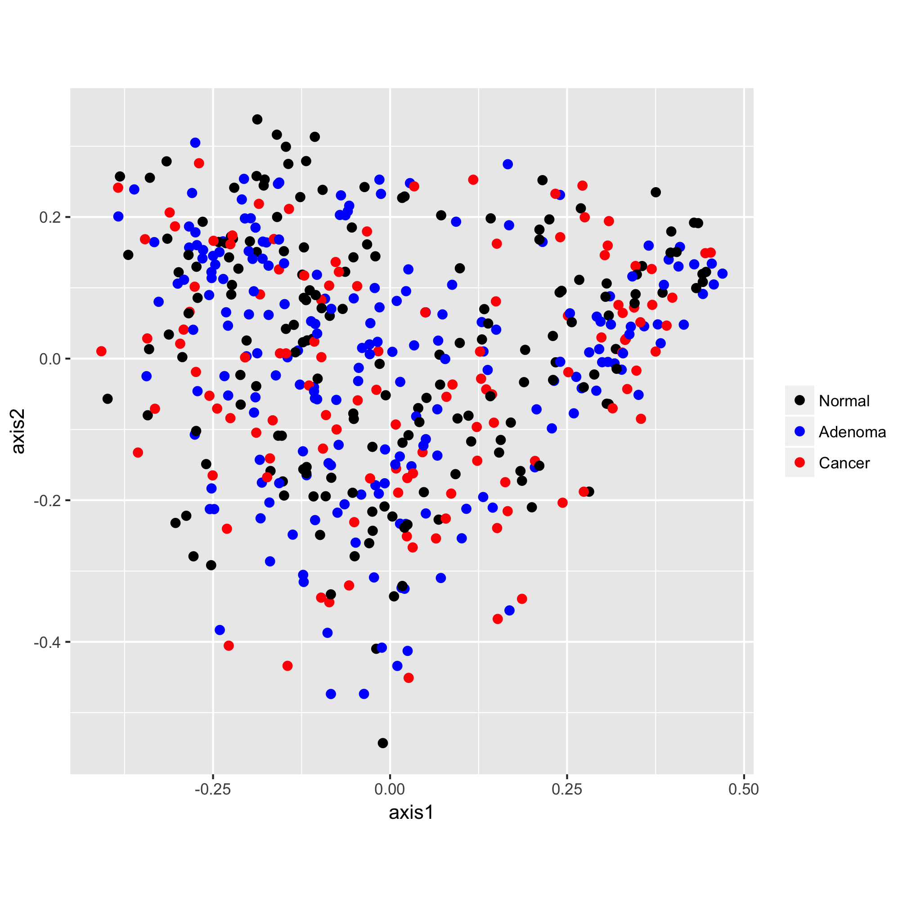
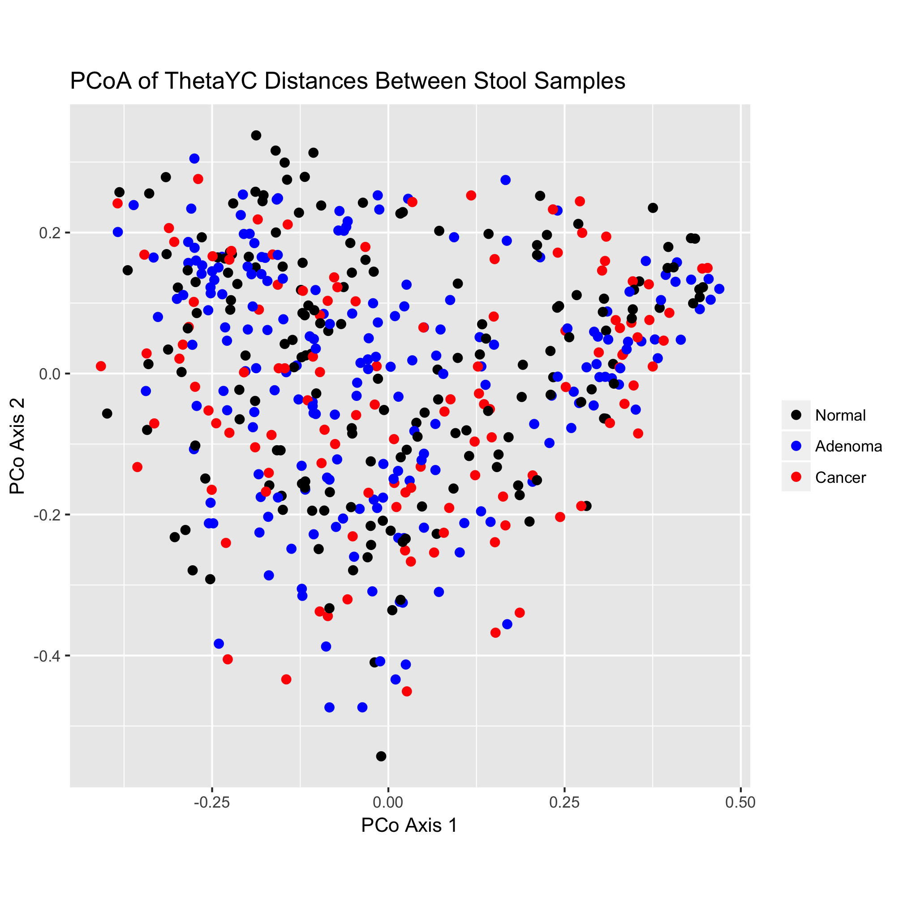
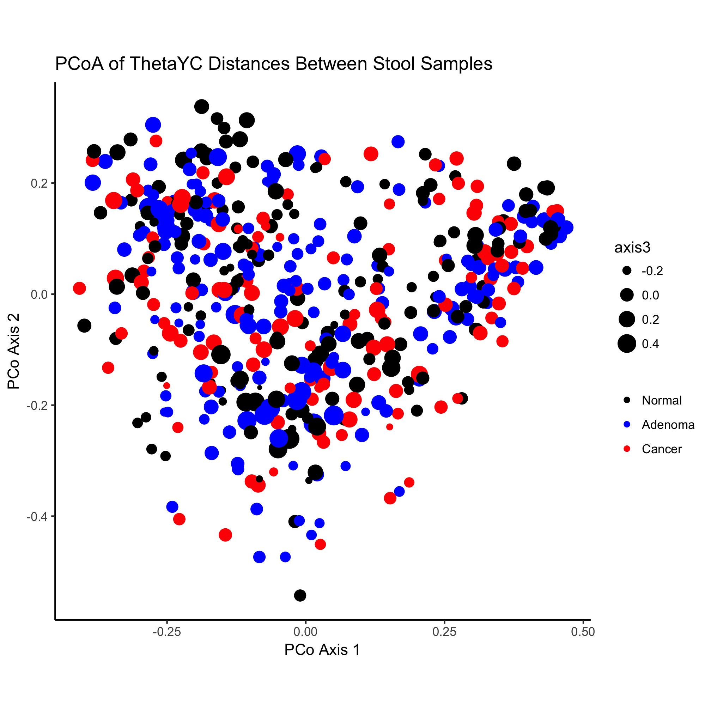
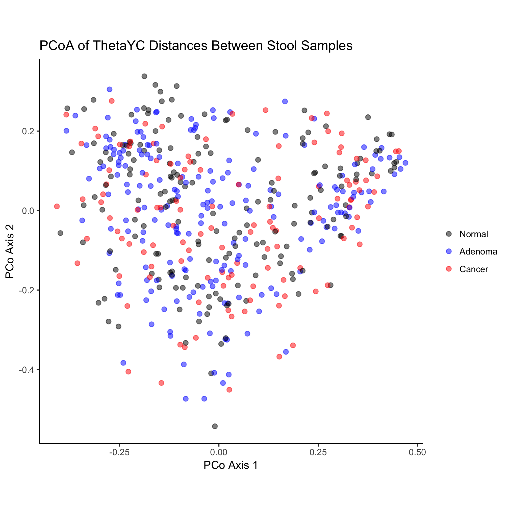

## Learning goals
* Determine when a scatter plot is an appropriate data visualization tool
* Manipulate plotting symbols
* Manipulate vectors
* Create variables to make code DRY
* Adapt existing code to achieve a goal
* Install R packages and libraries

## Scatter plots
[Scatter plots](https://en.wikipedia.org/wiki/Scatter_plot) are commonly used to plot two continuous variables against each other. Usually the x-axis contains the independent variable and the y-axis contains the dependent variable. For example, one could plot calories consumed on the x-axis and the individual's weight on the y-axis. Other times, it is used to visualize a correlation. For example, one might plot individuals' weights against their heights to see whether there is a linear relationship. In microbial ecology, a common approach is to use ordination to visualize the similarity between samples. In the case of Principle Coordinates Analysis (PCoA), the first axis explains the most variation in the data, the second axis explains the second most variation, and so forth. In the game of microbial ecology bingo, these ordinations represent the center square. Let's see how to make one in R.


```r
pcoa <- read.table(file="data/baxter.thetayc.pcoa.axes", header=T)

plot(x=pcoa$axis1, y=pcoa$axis2, xlab="PCo Axis 1", ylab="PCo Axis 2",
			xlim=c(-1.0, 1.0), ylim=c(-1.0, 1.0), pch=18, col="red", cex=0.5,
 			main="PCoA of ThetaYC Distances Between Stool Samples")
```



What's going on in this chunk of code?


### Activity 1
* Edit this code to reduce the space between the plotting symbols and the axes
* Change the plotting symbol from a red diamond to a solid blue circle
* Make the plotting symbols a smidge larger

<input type=button class=hideshow style="margin-bottom: 20px"></input>
<div style="display: none">


```r
pcoa <- read.table(file="data/baxter.thetayc.pcoa.axes", header=T)

plot(x=pcoa$axis1, y=pcoa$axis2, xlab="PCo Axis 1", ylab="PCo Axis 2",
			xlim=c(-0.5, 0.6), ylim=c(-0.6, 0.5), pch=19, col="blue", cex=0.75,
 			main="PCoA of ThetaYC Distances Between Stool Samples")
```


</div>

### Activity 2
* Write code for a new plot, and adapt the code to plot PCo axes 2 and 3

<input type=button class=hideshow style="margin-bottom: 20px"></input>
<div style="display: none">


```r
pcoa <- read.table(file="data/baxter.thetayc.pcoa.axes", header=T)

plot(x=pcoa$axis2, y=pcoa$axis3, xlab="PCo Axis 2", ylab="PCo Axis 3",
			xlim=c(-0.6, 0.4), ylim=c(-0.4, 0.6), pch=19, col="blue", cex=0.75,
 			main="PCoA of ThetaYC Distances Between Stool Samples")
```


</div>

## Working with vectors
In the plot we generated above we used a combination of vectors and scalars to hold numbers and strings. Our `ylim` value was `c(-1.0, 1.0)` is a funky looking vector that actually contains two values: -1.0 and 1.0. As you probably found changing these values changed the bounds on the ordination plot. In the plot command above there were several vectors that can take or or more values:  x, y, xlim, ylim, pch, col, and cex. You'll probably notice that some of these vectors only had one value. For example, pch, col, and cex only took a single value in this case. How do you think you'd change our original code to alternate between pch values of 1 and 19?

<input type=button class=hideshow style="margin-bottom: 20px"></input>
<div style="display: none">


```r
plot(x=pcoa$axis1, y=pcoa$axis2, xlab="PCo Axis 1", ylab="PCo Axis 2",
			xlim=c(-0.5, 0.5), ylim=c(-0.6, 0.4), pch=c(1,19), col="blue", cex=0.7,
 			main="PCoA of ThetaYC Distances Between Stool Samples")
```


</div>

What do you think we'd do if we wanted to alternate between red and blue colored points?

<input type=button class=hideshow style="margin-bottom: 20px"></input>
<div style="display: none">


```r
plot(x=pcoa$axis1, y=pcoa$axis2, xlab="PCo Axis 1", ylab="PCo Axis 2",
			xlim=c(-0.5, 0.5), ylim=c(-0.6, 0.4), pch=19, col=c("red", "blue"),
  		cex=0.7, main="PCoA of ThetaYC Distances Between Stool Samples")
```

</div>

What's happening in these examples is that R is repeating the `col` and `pch` vectors until it is the same length as the vectors in `x` and `y`. Because the order of points in our `pcoa` data frame are pretty random, these colors and symbols are pretty meaningless. As we go along, you'll see how we could change the shapes and colors so that it is easier to see which points come from people with normal colons or people with adenomas and carcinomas in their colons.

Using `c( ... )` is one approach to define a vector. Our code actually has another common way of defining a vector. Can you spot it? The x and y values that we are plotting are actually vectors. These are columns from the `pcoa` data frame. One difficulty we have with plotting ordinations is that the first two axes rarely represent much of the variation in the data and we long to represent a third dimension. We could do this with the color of the points, but we could also do it with the size of the point. We'll save the color approach for later. Altering the size of the plotting symbol is commonly called a ["bubble chart"](https://en.wikipedia.org/wiki/Bubble_chart). Let's see what happens when we use `pcoa$axis3` to alter the size of the plotting symbols.


```r
plot(x=pcoa$axis1, y=pcoa$axis2, xlab="PCo Axis 1", ylab="PCo Axis 2",
			xlim=c(-0.5, 0.5), ylim=c(-0.6, 0.4), pch=19, col="blue",
  		cex=pcoa$axis3, main="PCoA of ThetaYC Distances Between Stool Samples")
```



Hmmmm. Let's see whether we can learn something more about the values in that third dimension. We'll use the `summary` function


```r
summary(pcoa$axis3)
```

```
##    Min. 1st Qu.  Median    Mean 3rd Qu.    Max. 
## -0.2575 -0.1038 -0.0268  0.0000  0.0660  0.5383
```

Look at that - a nice, compact summary of the distribution of points in the third dimension. I'd like to scale the point sizes so that the mean `pch` value is 1.0. What do you think we should do?


```r
summary(pcoa$axis3 + 1)
```

```
##    Min. 1st Qu.  Median    Mean 3rd Qu.    Max. 
##  0.7425  0.8962  0.9732  1.0000  1.0660  1.5383
```

Did you see what happened that was really cool? I was able to easily add 1 to every value in the vector. Here are some summary commands, what's going on in each? Can you come up with your own?


```r
summary(pcoa$axis3 ^ 2)
summary(pcoa$axis3 * 2)
summary(log(abs(pcoa$axis3)))
```

Cool, now what do we do with that? Well we could do this:


```r
plot(x=pcoa$axis1, y=pcoa$axis2, xlab="PCo Axis 1", ylab="PCo Axis 2",
			xlim=c(-0.5, 0.5), ylim=c(-0.6, 0.4), pch=19, col="blue",
  		cex=pcoa$axis3+1, main="PCoA of ThetaYC Distances Between Stool Samples")
```



Alternatively, we could create a variable that holds the transformed data.


```r
scaled_axis3 <- pcoa$axis3+1

plot(x=pcoa$axis1, y=pcoa$axis2, xlab="PCo Axis 1", ylab="PCo Axis 2",
			xlim=c(-0.5, 0.5), ylim=c(-0.6, 0.4), pch=19, col="blue",
  		cex=scaled_axis3, main="PCoA of ThetaYC Distances Between Stool Samples")
```


Hmmm. I'm not seeing a big difference between the smallest and largest points. What if we were to double the value of our scaled variable?

<input type=button class=hideshow style="margin-bottom: 20px"></input>
<div style="display: none">


```r
scaled_axis3 <- 2 * pcoa$axis3 + 1

plot(x=pcoa$axis1, y=pcoa$axis2, xlab="PCo Axis 1", ylab="PCo Axis 2",
			xlim=c(-0.5, 0.5), ylim=c(-0.6, 0.4), pch=19, col="blue",
  		cex=scaled_axis3, main="PCoA of ThetaYC Distances Between Stool Samples")
```


That's a bit better.

</div>

I'm not sure how effective it is as a data visualization approach, but it helps to demonstrate two important things. First, by creating the variable `scaled_axis3` we have a value that we can use multiple places. Did you see we used it in the summary and plot commands? If we didn't create a variable, we would have to repeat `2 * pcoa$axis3 + 1` each time we wanted to use `scaled_axis3`. An important concept we will revisit is DRY: Don't Repeat Yourself. By using a variable instead of writing out the formula I only have to change the formula once if I decided to triple the value and then add 1. When you repeat yourself, you open your code to all sorts of problems when you forget to update every instance of the repetition. Second, we can layer data onto a two-dimensional plot to increase its dimensionality. If plotting the third dimension as the size of the plotting symbol isn't your thing, you could have used the patients' age, BMI, or any other continuous variable to scale the size of the points.


### Activity 3
* Think about the data in your research. What variables would you depict by changing the plotting symbol? The symbol color? The symbol's size?
* What is an appropriate number of colors or plotting symbols to use? Are there colors to stay away from?
* Freehand draw a scatter chart plot of your data. What question are you trying to answer with your plot? What variable goes on the x-axis? y-axis? How do you use color? symbols? size?
* What more do you need to learn to make the plot for your own data?

### Activity 4
* What do you think of this ordination? What works? What doesn't?
* What question(s) is it seeking to answer?
* List three things you'd do to improve the plot...


## Plotting symbols
One problem with the ordination is that there is a tendency for the points to fall on top of each other making for a big mass of point. Aside from using a different visualization approach, what can we do? We'll explore three approaches: altering the plotting symbol, outlining our symbols, and changing the transparency of our points.

There are 25 different plotting symbols in R that can be set by giving a vector containing one or more value from 1 to 25 to the pch option in R's plotting commands. I tend to limit myself to a handful of these: open and closed squares, circles, or triangles. To keep myself from hunting for the right pch value, I made a cheat sheet:


You already played around with changing the plotting symbols in the earlier exercises. Among these 25 symbols, symbols 21 to 25 are unique. The symbol takes a color as does the border of the symbol. You can set the symbol color using the `bg` option and the border with the `col` option. Let's give this a shot with our ordination:


```r
plot(x=pcoa$axis1, y=pcoa$axis2, xlab="PCo Axis 1", ylab="PCo Axis 2",
		 xlim=c(-0.5, 0.5), ylim=c(-0.6, 0.4), pch=21, col="black", bg="red", cex=1,
		 main="PCoA of ThetaYC Distances Between Stool Samples")
```



We can also make the border thicker using the `lwd` option


```r
plot(x=pcoa$axis1, y=pcoa$axis2, xlab="PCo Axis 1", ylab="PCo Axis 2",
			xlim=c(-0.5, 0.5), ylim=c(-0.6, 0.4), pch=21, col="black", bg="red",
			lwd=2, cex=1, main="PCoA of ThetaYC Distances Between Stool Samples")
```



We can mix and match plotting symbols from 1 to 20 with those from 21 to 25


```r
plot(x=pcoa$axis1, y=pcoa$axis2, xlab="PCo Axis 1", ylab="PCo Axis 2",
		xlim=c(-0.5, 0.5), ylim=c(-0.6, 0.4), pch=c(19, 21), col=c("blue",
		"black"), bg="red", lwd=2, cex=1,
		main="PCoA of ThetaYC Distances Between Stool Samples")
```


Even with the increased contrast between plotting symbols that we get by putting a border on the plotting symbol there is a fair amount of over plotting going on here, which makes it difficult to differentiate our points. We'll use get an introduction to packages. One thing that makes R awesome is that anyone can create a package to extend the utility of the base package. This has resulted in a massive breadth of functionality. We'll see a number of packages as we go through these exercises. The package we're immediately interested in is called `scales` because it has a function called `alpha`, which modifies color opacity. We need to learn three things: how to install a package, how to load its library, and how to use alpha. Once you've installed a package, you can skip the `install.packages` step in all future R sessions; however, you need to use the `library` function whenever you reopen R in the future. Here we go...


```r
install.packages('scales', repos="https://cloud.r-project.org/")
```

```
## Installing package into '/Users/pschloss/Library/R/3.4/library'
## (as 'lib' is unspecified)
```

```
## 
## The downloaded binary packages are in
## 	/var/folders/8p/j4r5_4yn7jg5z3s6p_ky8lc40000gn/T//RtmpNBhZgQ/downloaded_packages
```

```r
library('scales')

plot(x=pcoa$axis1, y=pcoa$axis2, xlab="PCo Axis 1", ylab="PCo Axis 2",
		xlim=c(-0.5, 0.5), ylim=c(-0.6, 0.4), pch=16, col=alpha("red", alpha=0.25),
		lwd=2, cex=1, main="PCoA of ThetaYC Distances Between Stool Samples")
```


You can see that we used the `alpha` function to generate a color for the `col` option. Here we took `red` and made it 25% opaque. If four or more points were stacked up on each other, the overlapping region would be solid red. Go ahead and change the opacity to be 50%.

<input type=button class=hideshow style="margin-bottom: 20px"></input>
<div style="display: none">


```r
plot(x=pcoa$axis1, y=pcoa$axis2, xlab="PCo Axis 1", ylab="PCo Axis 2",
		xlim=c(-0.5, 0.5), ylim=c(-0.6, 0.4), pch=16, col=alpha("red", alpha=0.50),
		lwd=2, cex=1, main="PCoA of ThetaYC Distances Between Stool Samples")
```



</div>

### Activity 5
Can you alter the transparency of the plotting symbol to reflect the position of each point in the third dimension? You will need to scale the points to fall between 0.0 and 1.0. To get the minimum value in a vector you can use the `min` function and the maximum value using the `max` function.

<input type=button class=hideshow style="margin-bottom: 20px"></input>
<div style="display: none">


```r
plot(x=pcoa$axis1, y=pcoa$axis2, xlab="PCo Axis 1", ylab="PCo Axis 2",
		xlim=c(-0.5, 0.5), ylim=c(-0.6, 0.4), pch=16, col=alpha("red", alpha=(pcoa$axis3-min(pcoa$axis3))/(max(pcoa$axis3)-min(pcoa$axis3))),
		lwd=2, cex=1, main="PCoA of ThetaYC Distances Between Stool Samples")
```



</div>

### Activity 6
Take what you've learned in this session and prove to yourself that you can mix and match parameter values. For example, can you generate a plot with two different plotting symbols, colors, and opacities?

<script>
$( "input.hideshow" ).each( function ( index, button ) {
  button.value = 'Show an answer';
  $( button ).click( function () {
    var target = this.nextSibling ? this : this.parentNode;
    target = target.nextSibling.nextSibling;
    if ( target.style.display == 'block' || target.style.display == '' ) {
      target.style.display = 'none';
      this.value = 'Show an answer';
    } else {
      target.style.display = 'block';
      this.value = 'Hide answer';
    }
  } );
} );
</script>
